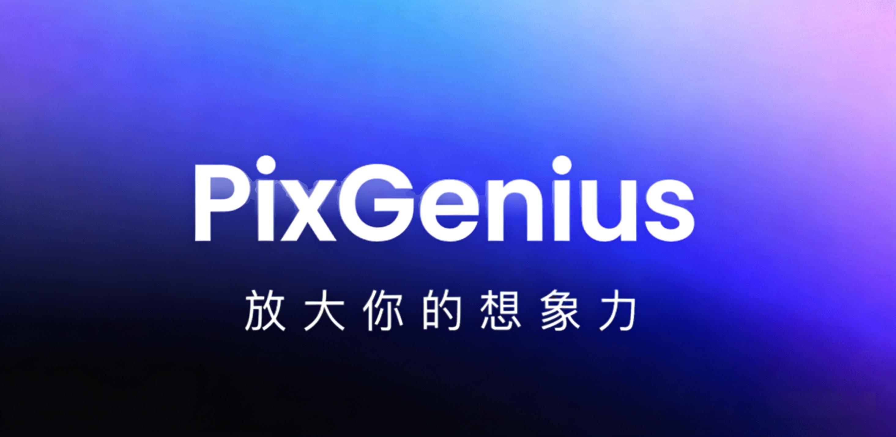

<div align="center">
  
</div>
555~，手贱把main分支不小心删除了，之前的提交记录都没了，难受

# PixGenius AI

**简介**
- 🎨 PixGenius AI：开箱即用的智能图像创作平台，支持本地 ComfyUI 与云端 DashScope；实时进度、参数可调、结果管理、登录与积分一站式搞定。
- 🚀 基于 Spring Boot 3 + Vue 3 的前后端分离 AI 生图解决方案。默认对接 ComfyUI（本地 Stable Diffusion），也可一键切换到阿里云百炼 DashScope。内置任务队列与进度回传、提示词与采样器/步数/尺寸等参数配置、历史记录与下载、JWT 鉴权与站点访问密码、积分体系与人机验证，适合个人开发者与中小团队快速上线。

**核心亮点**
- 🖌️ 文生图 T2I：本地 SD/ComfyUI 或云端 DashScope 二选一  
- ⚡ 实时进度：WebSocket 回传执行状态  
- 🧰 可调参数：采样器/步数/CFG/尺寸/张数等  
- 🗂️ 结果管理：历史记录、图片预览与下载  
- 🔐 安全体系：JWT 登录、站点访问密码、人机验证  
- 🧮 积分机制：可扩展的账户与扣费流程  
- 🧩 易扩展：清晰的 Controller/Service/Mapper 分层与前端组件化

**技术栈**
- 🖥️ 后端：Java 17、Spring Boot 3、MyBatis-Plus、Redis/Redisson、Retrofit2、FreeMarker、WebSocket、MySQL  
- 🖼️ 前端：Vue 3、TypeScript、Vite、Element Plus、Pinia、Axios、STOMP  
- 🧱 基础设施：ComfyUI、Docker Compose（示例）

## 技术栈
- 后端
  - Java 17、Spring Boot 3.2.x
  - MyBatis-Plus、MySQL 8
  - Redis + Redisson
  - Retrofit2（对接 ComfyUI / 外部服务）
  - FreeMarker（生成 ComfyUI 工作流请求）
  - WebSocket（消息/进度）
  - Maven、JUnit 5
- 前端
  - Vue 3、TypeScript、Vite 5
  - Element Plus、Pinia、Axios、STOMP
- 基础设施
  - ComfyUI（本地/容器）
  - Docker Compose（示例依赖编排）

## 快速开始

### 1. 克隆项目

```bash
git clone https://github.com/05Huang/PixGenius-AI.git
cd PixGenius-AI-main
```

### 2. 初始化数据库
1) 安装并启动 MySQL 8  
2) 创建数据库：
```sql
CREATE DATABASE pixgenius DEFAULT CHARACTER SET utf8mb4 COLLATE utf8mb4_unicode_ci;
```
3) 导入根目录下的 `pixgenius.sql`。

### 3. 启动依赖服务（可选 Docker）
项目提供了一个示例编排文件 `pixgenius/docker-compose-env.yml`，包含 ComfyUI / MySQL / Redis。注意：该文件使用 `network_mode: host`，更适合在 Linux 服务器上运行。

```bash
cd pixgenius
docker compose -f docker-compose-env.yml up -d
```

或自行本地安装启动 MySQL 与 Redis。

### 4. 配置后端
后端配置文件：`pixgenius/src/main/resources/application.yml`
- 数据库：
  - `spring.datasource.url`（可用 `DB_HOST/DB_PORT/DB_USERNAME/DB_PASSWORD` 环境变量覆盖）
- Redis：
  - `spring.data.redis.host`、`spring.data.redis.port`（可用 `REDIS_HOST/REDIS_PORT` 环境变量覆盖）
- 站点访问密码（可选）：
  - `site.access.password`（可用 `SITE_PASSWORD` 环境变量覆盖）
- DashScope（可选，云端生图）：
  - `dashscope.api-key` 请配置为你自己的 API Key（建议改为环境变量或启动参数注入）
- ComfyUI 连接
  - 在后端 `ComfyuiConfig` 中配置 `baseUrl` 与 WebSocket 地址（默认为内网示例，如需本地请改为 `http://localhost:8188` 与 `ws://localhost:8188/ws`）。

示例（本地开发）：
- MySQL：`DB_HOST=localhost DB_PORT=3306 DB_USERNAME=root DB_PASSWORD=yourpass`
- Redis：`REDIS_HOST=localhost REDIS_PORT=6379`
- ComfyUI：本地运行并监听 `8188`

### 5. 启动后端
确保已安装 JDK 17 与 Maven：
```bash
cd pixgenius
mvn spring-boot:run
# 或
mvn clean package -DskipTests
java -jar target/pixgenius.jar
```
默认后端端口：`http://localhost:8080`

### 6. 配置与启动前端
前端位于 `pixgenius-ui`：
1) 创建开发环境变量文件 `.env.development`（推荐）：
```bash
cd ../pixgenius-ui
type NUL > .env.development  # Windows 创建空文件；macOS/Linux: touch .env.development
```
在文件中填入（示例）：
```
VITE_APP_PORT=5173
VITE_PREFIX_BASE_API=/dev-api
VITE_PROXY_URL=http://localhost:8080
```
2) 安装依赖并启动：
```bash
npm install
npm run dev
```
访问前端：`http://localhost:5173`

> 说明：Vite 配置依赖上述环境变量；若未设置 `VITE_APP_PORT` 等，可能导致端口或代理行为异常。

## 项目结构

```
PixGenius-AI-main/
├─ images/                     # 项目宣传图等静态资源
├─ pixgenius/                  # 后端：Spring Boot 3 服务
│  ├─ src/main/java/...
│  ├─ src/main/resources/
│  │  └─ application.yml       # 后端主配置
│  ├─ pom.xml                  # Maven 构建描述
│  └─ docker-compose-env.yml   # 依赖服务编排示例（Linux 更佳）
├─ pixgenius-ui/               # 前端：Vue3 + TS + Vite
│  ├─ src/
│  ├─ package.json
│  └─ vite.config.ts
├─ pixgenius.sql               # 数据库初始化脚本
└─ README.md                   # 项目说明文档（本文件）
```

## 配置与部署

### 环境变量（后端）
- 数据库（可覆盖 application.yml）：
  - `DB_HOST`、`DB_PORT`、`DB_USERNAME`、`DB_PASSWORD`
- Redis：
  - `REDIS_HOST`、`REDIS_PORT`
- 站点访问密码：
  - `SITE_PASSWORD`（默认 `admin123`，请务必在生产环境修改）
- DashScope：
  - 建议以 `-Ddashscope.api-key=xxx` 或环境变量方式注入，避免明文保存在仓库
- ComfyUI：
  - 在 `ComfyuiConfig` 中设置 `http://<your-host>:8188` 与 `ws://<your-host>:8188/ws`

### 生产构建与部署
- 后端
  - 构建：`mvn clean package -DskipTests`
  - 运行：`java -jar target/pixgenius.jar`
  - 环境变量/启动参数：通过系统环境变量或 `-D` 方式注入敏感配置
- 前端
  - 构建：`npm run build`
  - 产物：`dist/`
  - 部署：Nginx/静态服务器托管，并配置反向代理至后端

Nginx 反代示例：
```
server {
  listen 80;
  server_name your.domain.com;

  root /var/www/pixgenius-ui/dist;
  index index.html;

  location / {
    try_files $uri $uri/ /index.html;
  }

  location /api/ {
    proxy_pass http://127.0.0.1:8080/;
    proxy_set_header Host $host;
    proxy_set_header X-Real-IP $remote_addr;
    proxy_set_header X-Forwarded-For $proxy_add_x_forwarded_for;
  }
}
```

## 贡献指南
- 欢迎提交 Issue 与 PR！建议在提交前简要描述问题与重现步骤。
- 代码规范
  - 后端：Java 17 + Spring Boot，保持 Controller/Service/Mapper 分层清晰，避免在仓库中提交敏感配置。
  - 前端：Vue3 + TS，组件化开发，复用公共样式与工具。
- 提交信息：推荐使用简洁、语义化的提交信息（如 feat/fix/docs/chore）。

## License
本项目在 MIT License 下发布。你可以自由地使用、修改和分发本项目代码，但请保留原始许可证声明。

